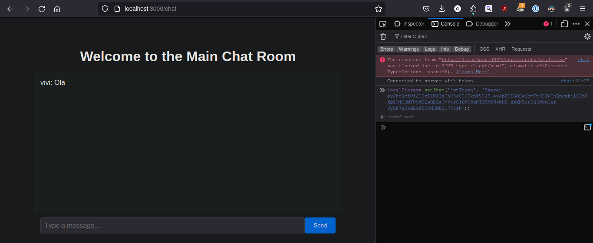
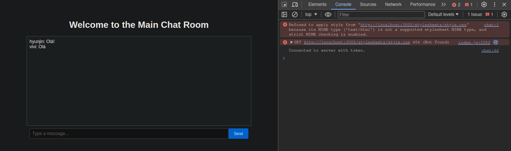

# Documentação do aplicativo Omni

## 1. Visão geral

O Omni é um aplicativo da Web do Node.js que oferece suporte à autenticação de usuários e à comunicação em tempo real por meio de uma interface de bate-papo. Ele foi projetado para demonstrar operações fundamentais de backend, interação em tempo real com o Socket.io e uso da API REST para gerenciamento de usuários.

## 2. Stack de tecnologia

- **Node.js**: O ambiente de tempo de execução para a lógica do lado do servidor.
- **Express**: Estrutura usada para criar o servidor da Web.
- **Sequelize**: ORM para interagir com o banco de dados MySQL.
- **MySQL**: O banco de dados relacional para armazenar dados do usuário e mensagens de bate-papo.
- **Socket.io**: Permite a comunicação bidirecional em tempo real entre clientes da Web e o servidor.
- **JWT**: Usado para proteger e autenticar solicitações de API e conexões de soquete.
- **Passport**: Middleware de autenticação para Node.js.

## 3. Instruções de configuração

### Pré-requisitos
- Node.js instalado em sua máquina.
- Servidor MySQL em execução localmente ou acessível remotamente.
- Postman ou qualquer cliente de API para testar endpoints.

### Etapas de instalação

1. **Clone o repositório:**
  ```bash
  git clone [URL do repositório]
  cd omni
  ```
2. Instale as dependências:
```bash
npm install
```
3. Configuração do banco de dados:
Certifique-se de que o MySQL esteja em execução e crie um banco de dados nomeado de acordo com a configuração .env.

4. Configuração do ambiente:
Crie um arquivo .env em seu diretório raiz com as seguintes chaves:

```bash
DB_NAME=omni_db
DB_USER=root
DB_PASSWORD=senha
DB_HOST=localhost
JWT_SECRET=seu_jwt_secret
```

5. Inicie o servidor:

```bash
npm start
```
Isso iniciará o servidor em http://localhost:3000.


## 4. Guia do usuário

### Testando com o Postman

#### Registro de usuário
- **Endpoint:** POST `/users/`
- **Body:** 
  ```json
  {
    "name": "John Doe",
    "email": "john@example.com",
    "password": "123456"
  }
#### Login de usuário

- **Endpoint:** POST `/users/login`
- **Body:**
  ```json
  {
    "email": "john@example.com",
    "password": "123456"
  }
Observação: após o login bem-sucedido, use o JWT retornado para autenticar solicitações de bate-papo. Armazene esse token no navegador da Web usando:
```shell
localStorage.setItem('jwtToken', 'Bearer <your_jwt_token>');
```
#### Interface de bate-papo
Depois de fazer login e definir o token JWT, carregue a interface de bate-papo navegando até http://localhost:3000/chat.





## 5. Documentação da API

### Endpoints

#### Criar usuário
- **Endpoint:** POST `/users/`
- **Body:**
  ```json
  {
    "name": "string",
    "email": "string",
    "password": "string"
  }
### Login
- **Endpoint:** POST /users/login
- **Body:**
```json
{
  "email": "string",
  "password": "string"
}
```

### Rotas de bate-papo
### Interface da sala de bate-papo
- Ponto final: GET /chat
- Autenticação: JWT necessário no parâmetro de consulta.

### Recuperar todos os usuários
Para obter todos os usuários no banco de dados, envie uma solicitação GET para o ponto de extremidade /users:

```bash
curl -X GET http://localhost:3000/users
```
Isso retornará uma lista de todos os usuários com sua identificação, nome e e-mail.

### Recuperar um único usuário
Para obter um usuário específico por ID, você precisa do ID do usuário da saída anterior. Substitua :id pelo ID real do usuário.

```bash
curl -X GET http://localhost:3000/users/:id
```
Substitua :id pelo ID real do usuário que deseja recuperar. Isso deve retornar os detalhes do usuário, se encontrados.

### Atualizar informações do usuário
Para atualizar as informações de um usuário existente, use o método PUT. Você precisará incluir o novo nome e/ou e-mail no corpo da solicitação.

```bash
curl -X PUT http://localhost:3000/users/:id \
-H "Content-Type: application/json" \
-d '{"name": "Jane Doe", "email": "janedoe@example.com"}'
```
Substitua :id pelo ID do usuário. Isso deve atualizar o nome e o e-mail do usuário, se ele existir.

### Excluir um usuário
Para excluir um usuário, envie uma solicitação DELETE com o ID do usuário:

```bash
curl -X DELETE http://localhost:3000/users/:id
```
Substitua :id pelo ID real do usuário. Isso deve excluir o usuário e retornar um código de status 204 se for bem-sucedido.

### Tratamento de erros
Você também deve testar como a API trata os erros, como a tentativa de recuperar, atualizar ou excluir um usuário inexistente. Por exemplo, a tentativa de obter um usuário que não existe deve retornar um código de status 404:

```bash
curl -X GET http://localhost:3000/users/99999
```
Supondo que 99999 seja um ID que não existe no banco de dados.

## 6. Tratamento de erros
Os erros são registrados no console e retornados ao cliente com os códigos de status HTTP apropriados. Os erros de autenticação impedem que os usuários acessem a funcionalidade de bate-papo e exigem a verificação da validade do JWT.

## 7. Conclusão
Esta documentação deve fornecer todas as informações necessárias para configurar, testar e entender o aplicativo Omni. Para qualquer dúvida adicional ou solução de problemas, consulte o código-fonte e os registros de erros.