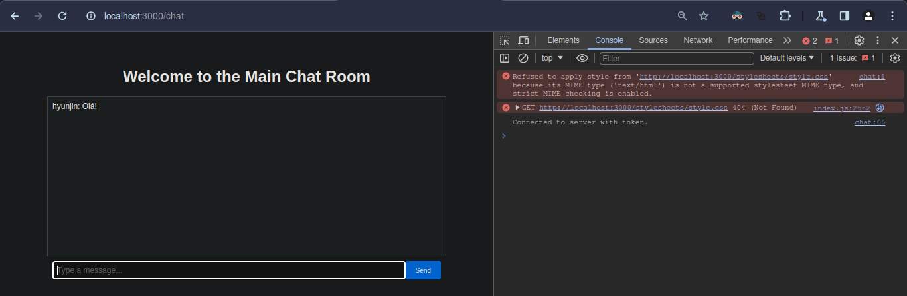
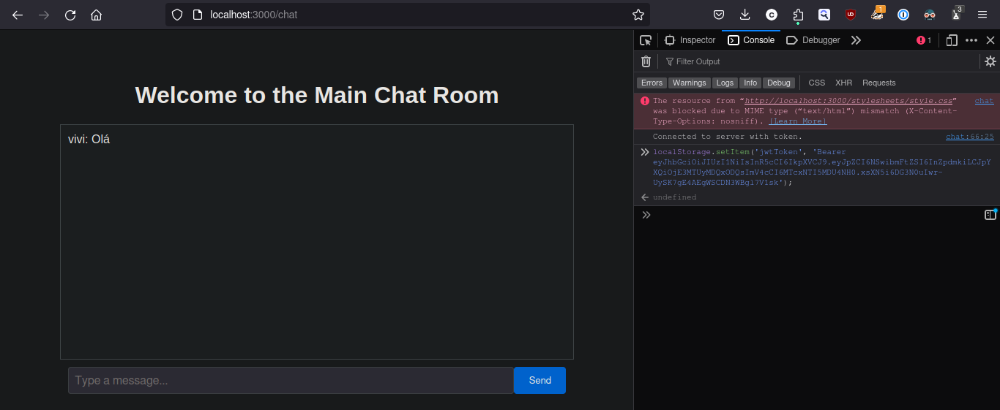

# Omni Application Documentation

## 1. General Overview

Omni is a Node.js web application that supports user authentication and real-time communication via a chat interface. It is designed to demonstrate fundamental backend operations, real-time interaction with Socket.io, and REST API usage for user management.

## 2. Technology Stack

- **Node.js**: The runtime environment for the server-side logic.
- **Express**: Framework used to build the web server.
- **Sequelize**: ORM for interacting with the MySQL database.
- **MySQL**: The relational database to store user data and chat messages.
- **Socket.io**: Enables real-time bi-directional communication between web clients and the server.
- **JWT**: Used for securing and authenticating API requests and socket connections.
- **Passport**: Authentication middleware for Node.js.
- **Jest**: Testing framework to run and manage tests.
- **Supertest**: Library to handle HTTP assertions, making it easy to test Node.js HTTP servers.
- **bcryptjs**: Library to hash passwords before storing them in the database.

## 3. Setup Instructions

### Prerequisites
- Node.js installed on your machine.
- MySQL server running locally or accessible remotely.
- Postman or any API client for testing endpoints.

### Installation Steps

1. **Clone the repository:**
   ```bash
   git clone [repository URL]
   cd omni

2. Install dependencies:
```bash
npm install
```
3. Database Setup:
Ensure MySQL is running and create a database named according to the .env configuration.

4. Environment Configuration:
Create a .env file in your root directory with the following keys:

```bash
DB_NAME=omni_db
DB_USER=root
DB_PASSWORD=password
DB_HOST=localhost
JWT_SECRET=your_jwt_secret
```

5. Start the Server:

```bash
npm start
```
This will start the server on http://localhost:3000.

## 3.5 Test the application

To test the application, run the following command:

```bash
npm test
```

### Test Descriptions

The integration tests focus on testing the CRUD operations related to users, as well as login functionality. Below is a breakdown of each test:

#### User Creation

- **Endpoint**: `POST /users`
- **Purpose**: Tests the creation of a new user. It checks if the response status code is 201 and confirms that the returned user email matches the input.

#### Retrieve All Users

- **Endpoint**: `GET /users`
- **Purpose**: Validates that the API can retrieve a list of users, ensuring the response contains at least one user and returns a status code of 200.

#### Retrieve Specific User

- **Endpoint**: `GET /users/:id`
- **Purpose**: Tests retrieval of a specific user by ID, verifying that the correct user data is returned with a status code of 200.

#### Update User Information

- **Endpoint**: `PUT /users/:id`
- **Purpose**: Ensures that user data can be updated correctly and that the response reflects the updated information with a status code of 200.

#### Delete User

- **Endpoint**: `DELETE /users/:id`
- **Purpose**: Confirms that a user can be successfully deleted, resulting in a status code of 204.

#### User Not Found After Deletion

- **Endpoint**: `GET /users/:id`
- **Purpose**: After deleting a user, this test checks that the user no longer exists, expecting a 404 status code.

#### Login Functionality

- **Success Case**: Tests successful login with correct credentials, expecting a 200 status code and a JWT token in the response.
- **Failure Case**: Incorrect password results in a 400 status code and an error message.
- **Missing Credentials**: Attempting to log in without a password or missing credentials should also return a 400 status code with an appropriate error message.


## 4. User Guide

### Testing with Postman

#### User Registration
- **Endpoint:** POST `/users/`
- **Body:** 
  ```json
  {
    "name": "John Doe",
    "email": "john@example.com",
    "password": "123456"
  }
#### User Login

- **Endpoint:** POST `/users/login`
- **Body:**
  ```json
  {
    "email": "john@example.com",
    "password": "123456"
  }
Note: Upon successful login, use the returned JWT for authenticating chat requests. Store this token on the web browser using:
```shell
localStorage.setItem('jwtToken', 'Bearer <your_jwt_token>');
```
#### Chat Interface
After logging in and setting the JWT token, load the chat interface by navigating to http://localhost:3000/chat.

## 5. API Documentation

### Endpoints

#### Create User
- **Endpoint:** POST `/users/`
- **Body:**
  ```json
  {
    "name": "string",
    "email": "string",
    "password": "string"
  }
### Login
- **Endpoint:** POST /users/login
- **Body:**
```json
{
  "email": "string",
  "password": "string"
}
```

### Chat Routes
### Chat Room Interface
- Endpoint: GET /chat
- Authentication: JWT required in the query parameter.

**Usuário Hyunjin conectou-se e enviou mensagem** 

**Usuário Vivi conectou-se e enviou mensagem** 

**Usuário Hyunjin recebeu a mensagem de Vivi**


### Retrieve All Users
To fetch all users in the database, send a GET request to the /users endpoint:

```bash
curl -X GET http://localhost:3000/users
```
This will return a list of all users with their id, name, and email.

### Retrieve a Single User
To fetch a specific user by ID, you need the user's ID from the previous output. Replace :id with the actual user ID.

```bash
curl -X GET http://localhost:3000/users/:id
```
Replace :id with the actual ID of the user you wish to retrieve. This should return the user's details if found.

### Update User Information
To update information for an existing user, use the PUT method. You'll need to include the new name and/or email in the request body.

```bash
curl -X PUT http://localhost:3000/users/:id \
-H "Content-Type: application/json" \
-d '{"name": "Jane Doe", "email": "janedoe@example.com"}'
```
Replace :id with the user ID. This should update the user's name and email if the user exists.

### Delete a User
To delete a user, send a DELETE request with the user ID:

```bash
curl -X DELETE http://localhost:3000/users/:id
```
Replace :id with the actual user ID. This should delete the user and return a 204 status code if successful.

### Error Handling
You should also test how the API handles errors, such as trying to retrieve, update, or delete a non-existent user. For instance, attempting to get a user that doesn't exist should return a 404 status code:

```bash
curl -X GET http://localhost:3000/users/99999
```
Assuming 99999 is an ID that does not exist in the database.

## 6. Error Handling
Errors are logged on the console and returned to the client with appropriate HTTP status codes. Authentication errors prevent users from accessing the chat functionality and require checking the JWT validity.

## 7. Conclusion
This documentation should provide all the necessary information to set up, test, and understand the Omni application. For any additional queries or troubleshooting, refer to the source code and error logs.